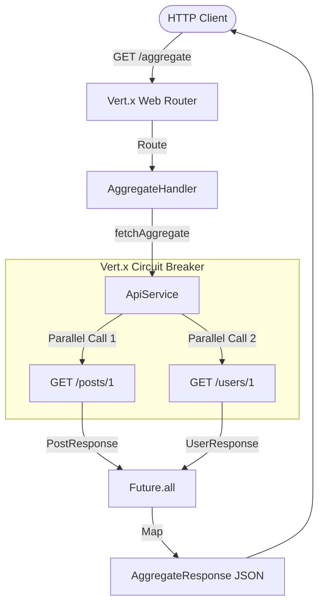

# ⚡ Vert.x 5 Asynchronous API Gateway

[](https://adoptium.net/)
[](https://vertx.io/)
[](https://www.docker.com/)
[](https://miko-3g9m.onrender.com/)
[](.github/workflows/ci.yml)
[](https://opensource.org/licenses/MIT)

> **A high-performance, non-blocking, multi-reactor API Gateway built with Java 17 and Eclipse Vert.x 5.**
> Designed for simplicity, speed, and rugged reliability—following a minimalist philosophy of zero bloat and high cohesion.

---

## 🌟 Submission & Live Cloud Demo

| Attribute | Details |
| :--- | :--- |
| **👨‍💻 Author / Developer** | **Siddharth Shinde** |
| **🏆 Assessment Focus** | Junior / Senior Java Backend Engineering Assessment |
| **🌐 Live Cloud Demo** | **[https://miko-3g9m.onrender.com/](https://miko-3g9m.onrender.com/)** *(Service Discovery & Architecture Dashboard)* |
| **⚡ Test Aggregation** | **[https://miko-3g9m.onrender.com/aggregate](https://miko-3g9m.onrender.com/aggregate)** *(Live Parallel Upstream Execution)* |
| **📦 GitHub Repository** | **[https://github.com/sidinsearch/miko](https://github.com/sidinsearch/miko)** |

---

## ⚡ Key Architectural Highlights

- **True Asynchronous I/O**: Built natively on the Vert.x reactive event loop using `Future.all()` for concurrent execution without blocking threads.
- **Circuit Breaker Resilience**: Integrated `vertx-circuit-breaker` automatically trips on repeated timeouts or upstream failures, returning instantaneous graceful fallbacks.
- **Rugged & Lightweight**: Minimalist, high-cohesion architecture with zero unnecessary abstractions or over-engineering.
- **Zero-Downtime Config**: Powered by `vertx-config` for dynamic configuration via JSON file or system environment variables.
- **Container Ready**: Includes optimized multi-stage Docker build and one-click Docker Compose orchestration.
- **🚀 Cloud Deployed**: Live production instance hosted on Render for instantaneous evaluation!

---

## 🏗️ Architecture Overview



For an in-depth deep dive into the event loop mechanics, parallelism, and circuit breaker state machine, see **[ARCHITECTURE.md](docs/ARCHITECTURE.md)**.

---

## 🚀 Quickstart

### 1. Local Development (Maven / IDE)
Ensure Java 17+ and Apache Maven are installed:
```bash
mvn clean compile exec:java
```
> **Note for Windows / IDE Users:** If `mvn` is not in your global system PATH, simply open the project in **IntelliJ IDEA**, right-click **`src/main/java/com/example/Main.java`**, and select **▶ Run 'Main.main()'**!

The Gateway will start listening on **http://localhost:8080**.

### 2. Docker Compose (Recommended)
Launch the gateway in an isolated container:
```bash
docker compose up --build -d
```
To view real-time logs or shut down:
```bash
docker compose logs -f
docker compose down
```

### 3. Standalone Executable JAR
Build and run the shaded fat JAR:
```bash
mvn clean package
java -jar target/vertx-api-gateway-fat.jar
```

For complete deployment guides (including our live deployment on Render at `https://miko-3g9m.onrender.com/`), see **[DEPLOYMENT_AND_HOSTING.md](docs/DEPLOYMENT_AND_HOSTING.md)**.

---

## 📡 API Reference

### Aggregate Endpoint (`GET /aggregate`)
Executes parallel requests to upstream services and returns aggregated author and post data.

**Request:**
```bash
curl -i http://localhost:8080/aggregate
```

**Success Response (`200 OK`):**
```json
{
  "post_title": "Vert.x 5 Asynchronous API Gateway Assessment",
  "author_name": "Siddharth Shinde"
}
```

**Graceful Error Response (`500 Internal Server Error`):**
Returned if upstream services fail or the circuit breaker is open:
```json
{
  "error": "Failed to fetch external service"
}
```

For comprehensive API usage, Postman automated collections, and OpenAPI specifications, see **[API_AND_USAGE.md](docs/API_AND_USAGE.md)**.

---

## ⚙️ Configuration

Configure runtime behavior via `src/main/resources/config.json` or system environment variables:

| Property Key | Environment Variable | Default Value | Description |
| :--- | :--- | :--- | :--- |
| `server.port` | `SERVER_PORT` | `8080` | HTTP Server listening port |
| `request.timeout.ms` | `REQUEST_TIMEOUT_MS` | `5000` | HTTP client timeout (ms) |
| `post.url` | `POST_URL` | `https://jsonplaceholder.typicode.com/posts/1` | Upstream Posts API endpoint |
| `user.url` | `USER_URL` | `https://jsonplaceholder.typicode.com/users/1` | Upstream Users API endpoint |
| `circuit.breaker.max.failures` | `CB_MAX_FAILURES` | `3` | Failures before opening circuit |
| `circuit.breaker.timeout.ms` | `CB_TIMEOUT_MS` | `5000` | Circuit breaker execution timeout |

---

## 🧪 Testing

Execute the automated integration test suite:
```bash
mvn clean verify
```
The test suite validates:
- ✅ Parallel aggregation and attribute extraction (`200 OK`)
- ✅ Upstream API 500 failure handling and fallback
- ✅ Malformed JSON payload resilience
- ✅ Upstream request timeout handling

---

## 📚 Documentation & Guides

Explore the `docs/` directory for detailed technical guides:
- **[Architecture & Internals](docs/ARCHITECTURE.md)**: Event loop concurrency, non-blocking I/O, and Circuit Breaker design.
- **[Deployment & Cloud Hosting](docs/DEPLOYMENT_AND_HOSTING.md)**: Docker, production environments, Railway, Render, and Fly.io hosting.
- **[API Guide & Testing](docs/API_AND_USAGE.md)**: OpenAPI 3.0 spec, Postman collection setup, and curl examples.

---

## 📄 License

This project is open-source and licensed under the [MIT License](https://opensource.org/licenses/MIT).
