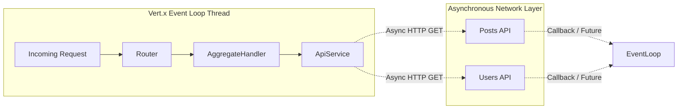
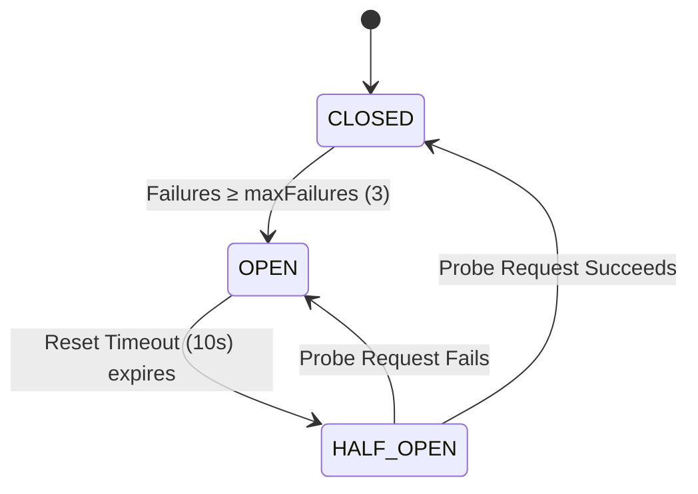
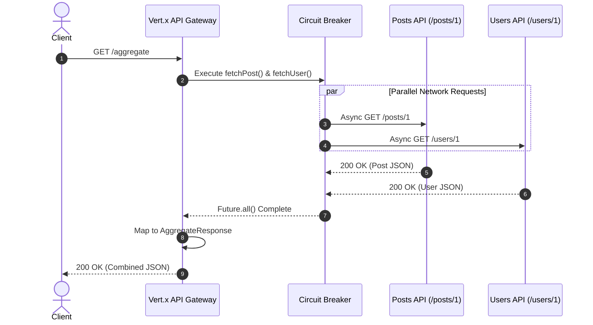

# 🏗️ System Architecture & Internals

This document explains the internal mechanics, concurrency model, and design philosophy of the Vert.x API Gateway.

---

## 1. Design Philosophy: Rugged Simplicity

In the spirit of minimalist, robust systems engineering (inspired by Unix and Linux core design principles), this API Gateway avoids bloated frameworks, reflection magic, and unnecessary layers of abstraction.

Every component has a single, well-defined responsibility:
- **`MainVerticle`**: Lifecycle management, configuration loading, and HTTP route wiring.
- **`ApiService`**: Upstream HTTP client communication, parallelism, and circuit breaker resilience.
- **`AggregateHandler`**: Request translation, JSON serialization, and HTTP response formatting.
- **`Records` (`*Response`)**: Pure, immutable data structures for type-safe JSON mapping without overhead.

---

## 2. Concurrency Model: The Reactive Event Loop

Traditional thread-per-request servers (like standard Servlet containers) block an OS thread for every incoming HTTP request while waiting for network I/O from upstream services. Under high concurrency, this leads to thread starvation, excessive memory usage, and context-switching bottlenecks.

This Gateway uses **Eclipse Vert.x**, which operates on the **Multi-Reactor Event Loop** pattern:



1. **Non-Blocking I/O**: When `ApiService` triggers HTTP requests to external services, no thread is blocked. The network request is delegated to Netty's asynchronous I/O engine.
2. **Event Loop Continuation**: The event loop thread immediately returns to handle other incoming client requests.
3. **Asynchronous Completion**: When upstream HTTP responses arrive over the network, an event is pushed to the event loop, which executes the completion handler to combine the JSON results.

---

## 3. Parallel Aggregation with `Future.all()`

To minimize latency, upstream calls must be executed concurrently, not sequentially.
If `/posts/1` takes $200\text{ ms}$ and `/users/1` takes $200\text{ ms}$, sequential execution would take $400\text{ ms}$. Parallel execution completes in $\max(200, 200) = 200\text{ ms}$.

In `ApiService.java`:
```java
Future<PostResponse> postFuture = fetchPost();
Future<UserResponse> userFuture = fetchUser();

return Future.all(postFuture, userFuture)
  .map(composite -> new AggregateResponse(
    composite.<PostResponse>resultAt(0).title(),
    composite.<UserResponse>resultAt(1).name()));
```

- `fetchPost()` and `fetchUser()` are dispatched simultaneously.
- `Future.all()` returns a composite future that completes only when **both** upstream requests succeed.
- If either request fails, times out, or returns malformed JSON, the composite future immediately fails, triggering graceful error handling.

---

## 4. Circuit Breaker State Machine

In distributed systems, external dependencies will eventually fail or experience high latency. Without protection, a slow upstream service will cause requests to pile up, exhausting system memory and cascading failure across the entire infrastructure.

We integrate `vertx-circuit-breaker` to wrap all outgoing network calls:



### State Behaviors:
- **`CLOSED` (Normal Operation)**: All requests are forwarded to external APIs. If an API call fails (HTTP 500, network timeout, or JSON parse error), an internal failure counter increments.
- **`OPEN` (Tripped State)**: Once failures reach `circuit.breaker.max.failures` (default: 3) within the timeout period, the breaker trips to `OPEN`. Subsequent incoming requests fail **instantly** without attempting network communication, protecting upstream servers and preserving local resources.
- **`HALF-OPEN` (Recovery Probe)**: After `circuit.breaker.reset.timeout.ms` (default: 10,000 ms), the breaker transitions to `HALF-OPEN`. The next request is allowed through as a test probe. If it succeeds, the breaker resets to `CLOSED`. If it fails, it trips back to `OPEN`.

---

## 5. Sequence Diagram


